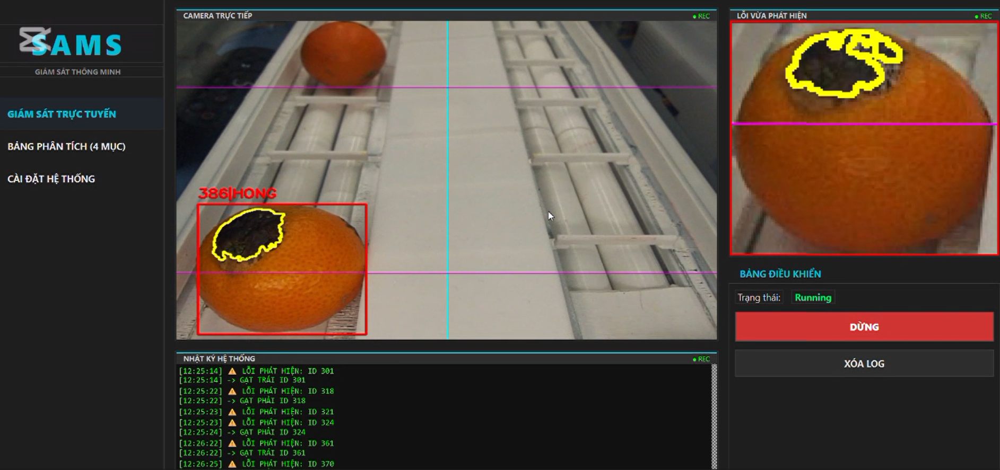
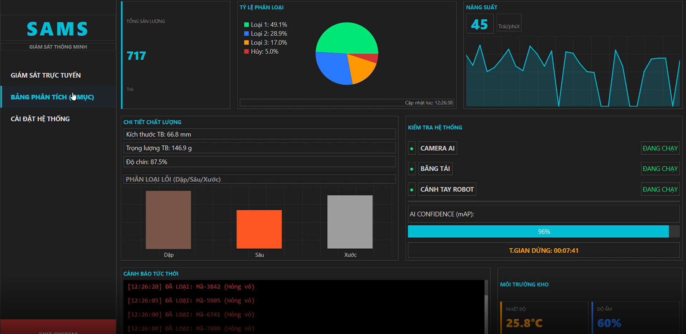

# Smart Orange Classification System

## 1. Project Overview

This project builds a vision-based orange sorting prototype using a Raspberry Pi camera, a laptop running YOLOv8/OpenCV, and an Arduino-controlled servo actuator.

The current implementation focuses on detecting oranges, identifying defective regions such as dark spots or stains, and triggering left/right sorting commands through the Raspberry Pi and Arduino.

The system is designed as a practical prototype for smart agriculture applications, combining computer vision, embedded devices and mechanical sorting control.

---

## 2. Demo Images

### Hardware Setup


### Sorting Mechanism


### Output Bins


### Live Monitoring - OK and Defect Detection


### Live Monitoring - Defect Detection



### Analytics Dashboard



> Note: The screenshots above show the monitoring and analytics interface used for system demonstration.
> The current repository mainly focuses on the computer vision pipeline, Raspberry Pi streaming and microcontroller-based sorting control.

---

## 3. System Workflow

```text
Raspberry Pi Camera
        ↓
Raspberry Pi Flask Streaming Server
        ↓
Laptop YOLOv8 + OpenCV Processing
        ↓
HTTP Control Command
        ↓
Raspberry Pi Serial Communication
        ↓
Arduino Servo Sorting Mechanism
```

Workflow steps:

1. Raspberry Pi captures video from the camera and streams it over HTTP.
2. The laptop receives the stream and processes frames using YOLOv8 and OpenCV.
3. YOLOv8 detects oranges from the camera input.
4. Traditional image processing is used to analyze defective regions on the orange surface.
5. The laptop sends `/control?id=1` or `/control?id=2` back to the Raspberry Pi.
6. The Raspberry Pi forwards the command through Serial to Arduino.
7. Arduino drives the servo actuator to sort the orange into the corresponding lane.

---

## 4. Technology Stack

* Python
* OpenCV
* YOLOv8 / Ultralytics
* Flask on Raspberry Pi
* pyserial / UART Serial Communication
* Raspberry Pi Camera Streaming
* Arduino Servo Control

---

## 5. Project Structure

```text
smart-orange-classification-system/
├── assets/
│   └── demo_images/
├── docs/
│   └── operation.md
├── models/
│   └── README.md
├── src/
│   ├── laptop/
│   │   ├── main_detect_sort.py
│   │   └── experiments/
│   ├── raspberry_pi/
│   │   └── pi_stream_control.py
│   └── arduino/
│       └── servo_sorter.ino
├── requirements-laptop.txt
├── requirements-pi.txt
├── .gitignore
└── README.md
```

---

## 6. Raspberry Pi Setup

Install required OS packages:

```bash
sudo apt update
sudo apt install -y python3-picamera2 python3-opencv python3-flask python3-serial
```

Install Python dependencies:

```bash
pip install -r requirements-pi.txt
```

Start the Raspberry Pi stream and control server:

```bash
python src/raspberry_pi/pi_stream_control.py
```

After starting the server, the laptop can access:

```text
http://<PI_IP>:5000/video
http://<PI_IP>:5000/control?id=1
http://<PI_IP>:5000/control?id=2
```

---

## 7. Laptop Setup

Install Python dependencies:

```bash
pip install -r requirements-laptop.txt
```

Download `yolov8n.pt` and place it at:

```text
models/yolov8n.pt
```

Model weight files such as `*.pt` are ignored by Git, so they are not included when cloning the repository.

Set the Raspberry Pi IP address if it is different from the default value in the script.

Windows PowerShell:

```powershell
$env:PI_IP="192.168.1.20"
```

macOS/Linux:

```bash
export PI_IP=192.168.1.20
```

Run the main processing script:

```bash
python src/laptop/main_detect_sort.py
```

---

## 8. Arduino Upload

1. Open `src/arduino/servo_sorter.ino` in Arduino IDE.
2. Select the correct Arduino board.
3. Select the correct COM port.
4. Upload the firmware to the Arduino.
5. Connect Arduino to the Raspberry Pi through USB Serial.

---

## 9. Current Sorting Behavior

The current version is a prototype with two-lane sorting behavior.

* The system detects oranges from the camera stream.
* Defective regions are detected using traditional image processing.
* Sorting commands are triggered based on fruit position and defect status.
* The laptop sends control commands to the Raspberry Pi.
* The Raspberry Pi forwards commands to Arduino.
* Arduino controls the servo actuator to guide the fruit into the target lane.

The current Arduino command set supports:

```text
id=1 → trigger sorting action 1
id=2 → trigger sorting action 2
```

---

## 10. Limitations

* Detection quality depends on lighting conditions and camera position.
* Dark shadows may affect defect detection accuracy.
* The current system focuses on defect-based sorting rather than full commercial-grade grading.
* Servo angle and delay may need adjustment depending on the actual mechanical setup.
* The dashboard shown in demo images is used for system demonstration and monitoring visualization.

---

## 11. Future Improvements

* Improve orange defect detection under different lighting conditions.
* Add size classification for large and small oranges.
* Extend the sorting output to four categories:

  * Large-good
  * Large-defective
  * Small-good
  * Small-defective
* Add a trained quality-grading model.
* Improve tracking logic to avoid repeated sorting commands for the same fruit.
* Optimize the Arduino control logic for continuous conveyor operation.
* Add a full web dashboard for real-time monitoring, data storage and statistical analysis.

---

## 12. Author

Dau Duc Luu
Information Technology Student at UNETI
GitHub: [github.com/dauduc-luu](https://github.com/dauduc-luu)
